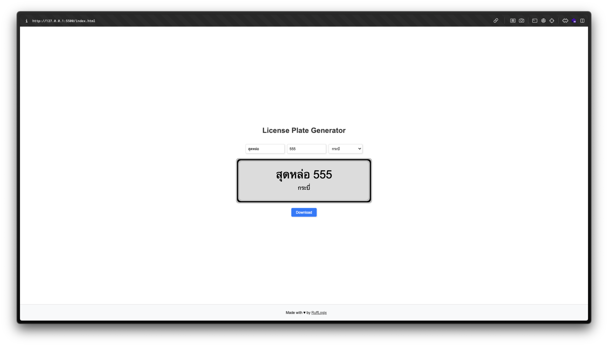

# License Plate Generator

This project allows you to create your own Thai license plates based on (?) the official naming conventions provided by the Thai government.

# Features

- Generate custom license plates by entering text and numbers.
- Choose the province for the license plate.
- Download the generated license plate image.

# How to use

1. **Enter Details**: Provide the desired `text`, `number`, and select a `province`.
2. **Generate Plate**: Click on `Download` to save your custom license plate image.

**Warning**: The use of counterfeit or unauthorized license plates is illegal and may result in criminal charges. This tool is intended for entertainment purposes only.

# Reference

- [นายทะเบียนทั่วราชอาณาจักร เรื่อง การกำหนดการใช้ตัวอักษรประจำหมวดและหมายเลขทะเบียนรถ สำหรับรถยนต์นั่งส่วนบุคคล ไม่เกิน 7 คน ที่จดทะเบียนในเขตกรุงเทพมหานคร (ฉบับที่ 7) พ.ศ.2567](https://ratchakitcha.soc.go.th/documents/34998.pdf)